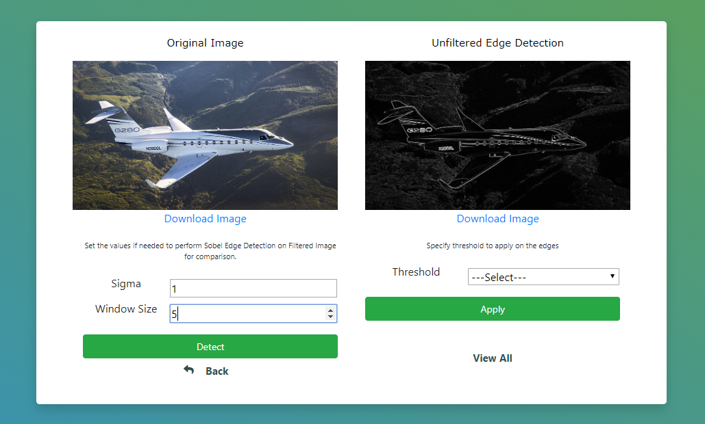

# SobelEdgeDetector

## Step 1- Run the App and Browse an image

## Step 2- Submit with default values of Sigma and Window Size. 
This detects the edges on the unfiltered image.  

The original image and edge detection on the original image is displayed as below: 

## Step 3- Try with different values of sigma and window size. 
Give the range of threshold to perform thresholding on the filtered image and press Apply. 

The edge detection on original image and edge detection on the filtered image are displayed as below: 

## Step 6: After detection both the output images will be displayed and available for download. 

## Step 7: View All

All the filtered images are displayed in one frame and availablefor download: 

